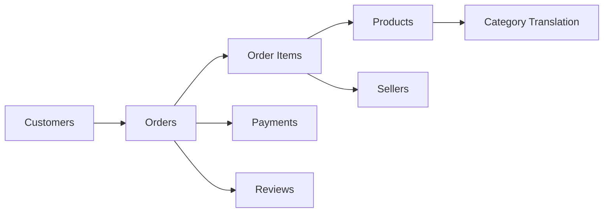

# E-Commerce-Sales-Customer-Experience-Delivery-Performance-Analysis
E-commerce data analysis using the Olist dataset. Includes data cleaning, preprocessing, sales and customer analysis, delivery performance, business insights, recommendations, and an interactive Looker Studio dashboard using Python and Pandas.

## Q1 — Dataset Selection
### 1. Dataset Name
 Brazilian E-Commerce Public Dataset by Olist

### 2. Source and URL

Source: Kaggle — Olist
- Olist Brazilian E-Commerce Dataset
- The dataset was provided by Olist and contains anonymized real commercial e-commerce data.

### 3. Number of rows and columns
 The dataset consists of multiple related CSV files, rather than one single table.
| Dataset | Approx. Rows |
|---------|-------------:|
| Orders | 99,441 |
| Customers | 99,441 |
| Order Items | 112,650 |
| Payments | 103,886 |
| Reviews | ~99,000+ |
| Products | 32,951 |
| Sellers | 3,095 |
| Geolocation | 1,000,163 |
This multi-table structure is particularly useful for demonstrating data joining and relational analysis.

### 4. Brief Description
 The dataset contains anonymized e-commerce transactions from Olist, a Brazilian online marketplace. It covers approximately 100,000 orders made between 2016 and 2018 and contains information about orders, customers, products, sellers, payments, reviews and logistics.

### 5. Why I selected this dataset?
 I selected this dataset because it contains a large volume of real-world commercial data and multiple related tables. It allows analysis across sales, customers, products, payments, delivery performance and customer satisfaction. The dataset is sufficiently complex to demonstrate data cleaning, joining, feature engineering, exploratory analysis and business-oriented visualization.

### 6. Business opportunities/problems
The dataset can help investigate:
**Sales and revenue trends**
**Product/category performance**
**Customer purchasing behavior**
**Regional performance**
**Delivery delays**
**Customer satisfaction**
**Payment behavior**
**Seller performance**
**Repeat-customer behavior**
**Opportunities to improve customer experience**

## Q2 — Business Problem
## A. How can an e-commerce company improve revenue and customer satisfaction by understanding product performance, customer behavior and delivery performance?
The analysis will focus on identifying areas where management can improve sales while reducing operational problems such as late deliveries and poor customer experiences.

## B. Five Questions
### Question 1 Which product categories generate the highest sales and revenue?
### Question 2 Which customer regions contribute the most revenue and orders?
### Question 3 How does delivery performance affect customer review scores?
### Question 4 What are the major sales trends over time?
### Question 5 Which customer/product/seller segments represent the greatest opportunity for improvement?

## Hypotheses
### H1: Late deliveries are associated with lower customer satisfaction.
 We will compare review scores between on-time and late deliveries. 
 This is particularly promising because existing analysis of this dataset reports average review scores of approximately 4.29 for on-time deliveries and 2.57 for late deliveries.

### H2: Sales are concentrated among a relatively small number of product categories and geographic regions.
We will test this using revenue/order contribution by category and state.

## Q3 — Data Processing
Use Python + Pandas + NumPy + Matplotlib/Seaborn.
The assessment specifically allows this approach.
### Tables to combine
The important tables are:
## Database Schema


The dataset's structure supports exactly this kind of relational analysis.

### Data-cleaning steps
#### 1. Missing values

 Missing values were identified in several date, product and categorical fields. Date fields were converted to appropriate datetime formats, while missing categorical values were retained where their absence itself represented information. Records were not blindly deleted because doing so could introduce selection bias.

#### 2. Duplicate records

Duplicate records were checked using appropriate identifiers such as order ID, customer ID and product ID. Duplicate rows were removed where they represented genuine duplicate records, while legitimate multiple order items were retained.

#### 3. Data types
Convert:
| Column | Data Type |
|--------|-----------|
| `order_purchase_timestamp` | `datetime` |
| `order_delivered_customer_date` | `datetime` |
| `order_estimated_delivery_date` | `datetime` |
| `price` | `numeric` |
| `freight_value` | `numeric` |
| `payment_value` | `numeric` |
| `review_score` | `integer` |
#### 4. Standardization

##### Standardize:

- category names
- date formats
- missing-value representation
- categorical labels
#### 5. Calculated fields

Create:
##### Revenue:
**Revenue = price**

or, depending on your chosen business definition:

**Order Value = price + freight_value**
##### Delivery Days:
**Delivery Days = Delivered Date - Purchase Date**

##### Expected Delivery Difference:

**Delivery Variance = Actual Delivery Date - Estimated Delivery Date**

##### Late Delivery:

**IF Delivery Variance > 0**
**THEN "Late"**
**ELSE "On Time"**

##### Customer Type

**1 order → One-time Customer**
**>1 order → Repeat Customer** 

## Q — Three Major Cleaning Decisions
#### Decision 1 — Date conversion:

**Change:** Converted timestamp columns into datetime format.
**Why:** Date calculations cannot be reliably performed on strings.
**If ignored:** Delivery duration and monthly trends could be incorrect.

#### Decision 2 — Missing values:

**Change:** Investigated missing values before deciding whether to remove, retain or transform them.
**Why:** Some missing values represent order that had not reached a particular stage.
**If ignored:** Removing them blindly could reduce the dataset and bias the analysis.

#### Decision 3 — Joining datasets:

**Change:** Joined orders, customers, products, order items, payments and reviews using their appropriate IDs.
**Why:** No individual table provides the complete business picture.
**If ignored:** We could analyze sales but wouldn't be able to connect sales with customer experience or delivery performance.

## Q4 — Business Insights
This is where you should make your project really strong.
The assessment requires**at least 5 meaningful insights.**

### Insight 1 — Revenue concentration

#### Insight:

Revenue is concentrated among a relatively small number of product categories.

#### Evidence:

Calculate:

```text
Revenue by Category=
Category Revenue
──────────────── × 100
Total Revenue

**Revenue by Category**

```text
Category Revenue / Total Revenue × 100

**Why management should care:**
A small number of categories may be responsible for a large proportion of revenue.

**Business impact:**

Better inventory and marketing allocation.

**Recommendation:**

Prioritize high-performing categories while investigating why lower-performing categories underperform.
