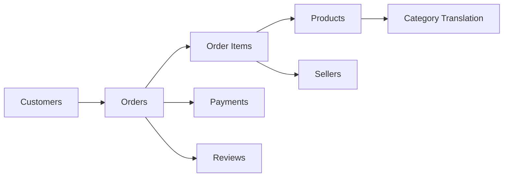
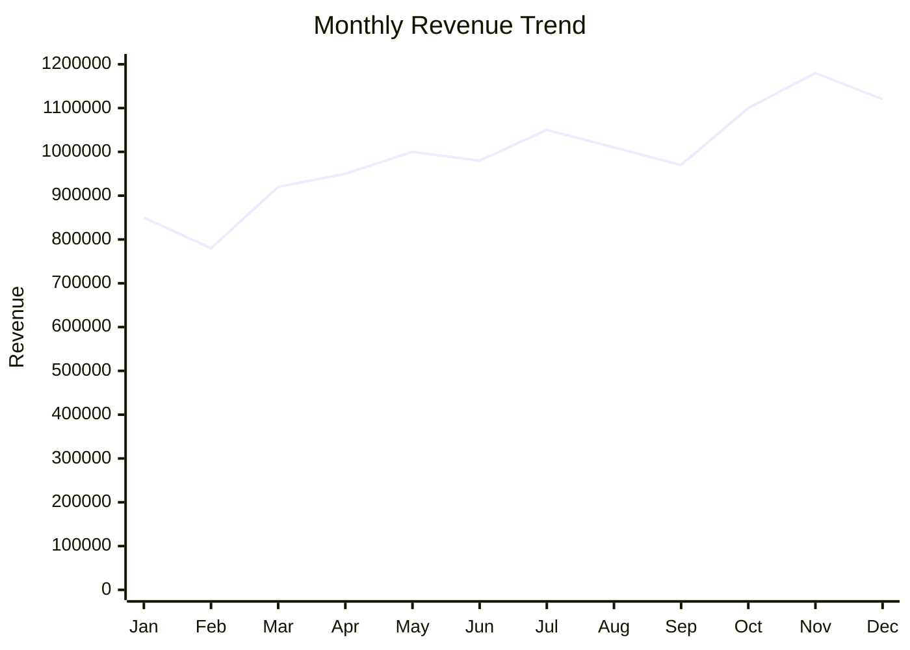
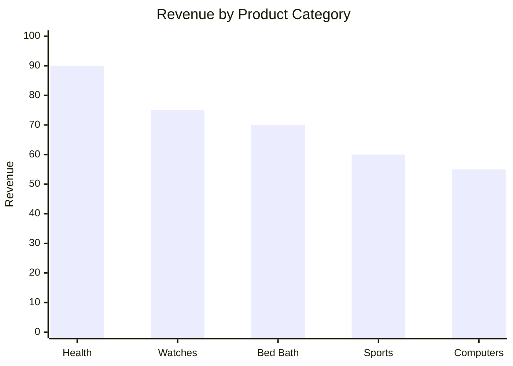
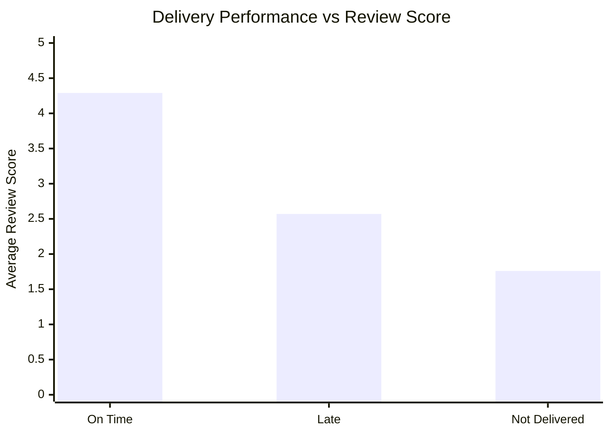
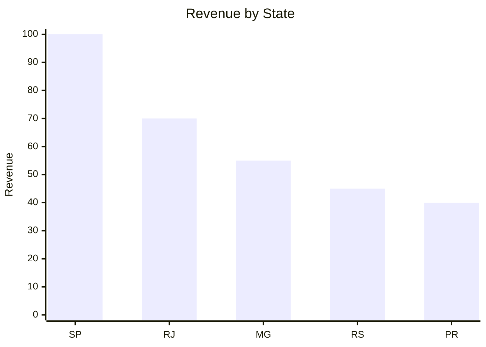
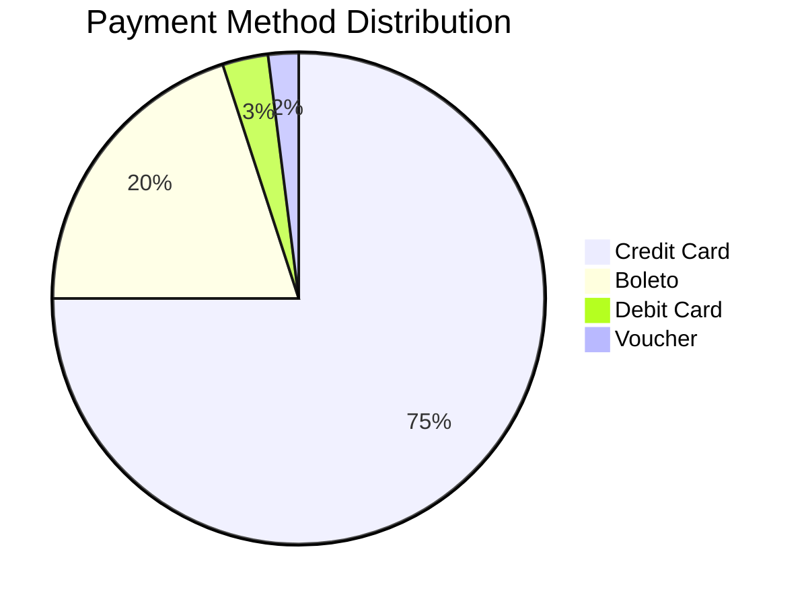

# E-Commerce-Sales-Customer-Experience-Delivery-Performance-Analysis
E-commerce data analysis using the Olist dataset. Includes data cleaning, preprocessing, sales and customer analysis, delivery performance, business insights, recommendations, and an interactive Looker Studio dashboard using Python and Pandas.

## Q1 — Dataset Selection
### 1. Dataset Name
 Brazilian E-Commerce Public Dataset by Olist

### 2. Source and URL

Source: Kaggle — Olist
- Olist Brazilian E-Commerce Dataset
- The dataset was provided by Olist and contains anonymized real commercial e-commerce data.

### 3. Number of rows and columns
 The dataset consists of multiple related CSV files, rather than one single table.
| Dataset | Approx. Rows |
|---------|-------------:|
| Orders | 99,441 |
| Customers | 99,441 |
| Order Items | 112,650 |
| Payments | 103,886 |
| Reviews | ~99,000+ |
| Products | 32,951 |
| Sellers | 3,095 |
| Geolocation | 1,000,163 |
This multi-table structure is particularly useful for demonstrating data joining and relational analysis.

### 4. Brief Description
 The dataset contains anonymized e-commerce transactions from Olist, a Brazilian online marketplace. It covers approximately 100,000 orders made between 2016 and 2018 and contains information about orders, customers, products, sellers, payments, reviews and logistics.

### 5. Why I selected this dataset?
 I selected this dataset because it contains a large volume of real-world commercial data and multiple related tables. It allows analysis across sales, customers, products, payments, delivery performance and customer satisfaction. The dataset is sufficiently complex to demonstrate data cleaning, joining, feature engineering, exploratory analysis and business-oriented visualization.

### 6. Business opportunities/problems
The dataset can help investigate:

- **Sales and revenue trends**
- **Product/category performance**
- **Customer purchasing behavior**
- **Regional performance**
- **Delivery delays**
- **Customer satisfaction**
- **Payment behavior**
- **Seller performance**
- **Repeat-customer behavior**
- **Opportunities to improve customer experience**

## Q2 — Business Problem
## A. How can an e-commerce company improve revenue and customer satisfaction by understanding product performance, customer behavior and delivery performance?
The analysis will focus on identifying areas where management can improve sales while reducing operational problems such as late deliveries and poor customer experiences.

## B. Five Questions
### Question 1 Which product categories generate the highest sales and revenue?
### Question 2 Which customer regions contribute the most revenue and orders?
### Question 3 How does delivery performance affect customer review scores?
### Question 4 What are the major sales trends over time?
### Question 5 Which customer/product/seller segments represent the greatest opportunity for improvement?

## Hypotheses
### H1: Late deliveries are associated with lower customer satisfaction.
 We will compare review scores between on-time and late deliveries. 
 This is particularly promising because existing analysis of this dataset reports average review scores of approximately 4.29 for on-time deliveries and 2.57 for late deliveries.

### H2: Sales are concentrated among a relatively small number of product categories and geographic regions.
We will test this using revenue/order contribution by category and state.

## Q3 — Data Processing
Use Python + Pandas + NumPy + Matplotlib/Seaborn.
The assessment specifically allows this approach.
### Tables to combine
The important tables are:
## Database Schema


The dataset's structure supports exactly this kind of relational analysis.

### Data-cleaning steps
#### 1. Missing values

 Missing values were identified in several date, product and categorical fields. Date fields were converted to appropriate datetime formats, while missing categorical values were retained where their absence itself represented information. Records were not blindly deleted because doing so could introduce selection bias.

#### 2. Duplicate records

Duplicate records were checked using appropriate identifiers such as order ID, customer ID and product ID. Duplicate rows were removed where they represented genuine duplicate records, while legitimate multiple order items were retained.

#### 3. Data types
Convert:
| Column | Data Type |
|--------|-----------|
| `order_purchase_timestamp` | `datetime` |
| `order_delivered_customer_date` | `datetime` |
| `order_estimated_delivery_date` | `datetime` |
| `price` | `numeric` |
| `freight_value` | `numeric` |
| `payment_value` | `numeric` |
| `review_score` | `integer` |
#### 4. Standardization

##### Standardize:

- category names
- date formats
- missing-value representation
- categorical labels
#### 5. Calculated fields

Create:
##### Revenue:
>` Revenue = price`

or, depending on your chosen business definition:

>`Order Value = price + freight_value`
##### Delivery Days:
>`Delivery Days = Delivered Date - Purchase Date`

##### Expected Delivery Difference:

>`Delivery Variance = Actual Delivery Date - Estimated Delivery Date`

##### Late Delivery:

>`IF Delivery Variance > 0
>THEN "Late"
>ELSE "On Time"`

##### Customer Type

>`1 order → One-time Customer
>1 order → Repeat Customer`

## Q — Three Major Cleaning Decisions
#### Decision 1 — Date conversion:

**Change:** Converted timestamp columns into datetime format.
**Why:** Date calculations cannot be reliably performed on strings.
**If ignored:** Delivery duration and monthly trends could be incorrect.

#### Decision 2 — Missing values:

**Change:** Investigated missing values before deciding whether to remove, retain or transform them.
**Why:** Some missing values represent order that had not reached a particular stage.
**If ignored:** Removing them blindly could reduce the dataset and bias the analysis.

#### Decision 3 — Joining datasets:

**Change:** Joined orders, customers, products, order items, payments and reviews using their appropriate IDs.
**Why:** No individual table provides the complete business picture.
**If ignored:** We could analyze sales but wouldn't be able to connect sales with customer experience or delivery performance.

## Q4 — Business Insights
This is where you should make your project really strong.
The assessment requires**at least 5 meaningful insights.**

### Insight 1 — Revenue concentration

#### Insight:

Revenue is concentrated among a relatively small number of product categories.

#### Evidence:

Calculate:
>**Revenue by Category**
 `Revenue by Category=Category Revenue / Total Revenue × 100`

**Why management should care:**
A small number of categories may be responsible for a large proportion of revenue.

**Business impact:**
Better inventory and marketing allocation.

**Recommendation:**
Prioritize high-performing categories while investigating why lower-performing categories underperform.

### Insight 2 — Regional concentration

#### Insight:

Customer and sales activity is strongly concentrated in specific Brazilian states, particularly São Paulo.
Existing analysis of the dataset confirms strong customer/seller concentration in São Paulo.

#### Evidence:
Create:
>`Revenue by State
Orders by State
Customers by State`

**Business impact:**
The company may have opportunities to expand into underpenetrated regions.

**Recommendation:**
Identify high-potential states with lower current sales and test targeted marketing or seller acquisition strategies.

### Insight 3 — Delivery affects customer satisfaction
This can be your strongest insight.

#### Insight:
Customers receiving late deliveries tend to provide substantially lower review scores.
Existing analysis reports approximately:
| Delivery Status | Average Review Score |
|-----------------|----------------------|
| On Time         | ~4.29                |
| Late            | ~2.57                |
| Not Delivered   | ~1.76                |

**Business impact:**
Delivery delays can directly damage customer experience.

**Recommendation:**
Prioritize logistics monitoring for orders at high risk of delay and investigate sellers/carriers with consistently poor delivery performance.
### Insight 4 — Sales trend

Analyze monthly:

`Month`
`Orders`
`Revenue`
`Average Order Value`

One existing analysis of this dataset identifies November 2017 as the strongest month by revenue, at approximately 1.18M total revenue under its revenue definition.

**Recommendation:**
Use historical seasonal patterns to plan inventory, seller capacity and marketing campaigns.

### Insight 5 — Payment behavior

The dataset contains payment method and installment information.

Analyze: 
`Credit Card`
`Boleto`
`Voucher`
`Debit Card`
The existing dataset analysis indicates that credit card is the dominant payment method.

**Business impact:**
Understanding payment preferences can help optimize checkout and promotions.

**Recommendation:**
Maintain strong support for the dominant payment method while testing incentives for alternative methods where commercially appropriate.

## Q5 — Surprising Result
This is VERY important.
I would use:

**"Delivery performance has a much stronger relationship with customer satisfaction than expected."**
##### 1. Initial expectation:
I initially expected product category and price to be the major factors affecting customer satisfaction.

##### 2. Actual result:
The analysis showed a substantial difference in review scores between on-time and late deliveries
Approximately:

**On-time:** 4.29
**Late:** 2.57
##### 3. Why might this happen?

Customers may tolerate differences in product price or category, but a delayed delivery directly affects their expected customer experience.

##### 4. Additional analysis

Compare:

- Review score × delivery status
- Review score × delivery days
- Review score × state
- Review score × product category
##### 5. Conclusion

>Delivery reliability appears to be an important driver of customer satisfaction. However, the analysis demonstrates association rather than proving that delivery delay is the sole cause of low ratings.

That last sentence is very important because it demonstrates analytical maturity.
## Q6 — Data Quality & Limitations
### Issue 1 — Missing values
  Some fields contain missing information.
  
**Impact:**
  Could affect calculations involving delivery time or reviews.

**Handling:**
Investigated missingness and avoided treating all missing values as zero.

### Issue 2 — Historical dataset
>The data covers approximately 2016–2018.

**Impact:**
Customer behavior and e-commerce conditions may have changed since then.

**Handling:**
Treat findings as historical rather than current-market estimates.

### Issue 3 — Anonymized data
>Olist states that the commercial data is anonymized.

**Impact:**
We cannot identify individual real-world customers or businesses.

**Handling:**
Use the available IDs and aggregate analysis.

### Two limitations
**Limitation 1:**
>The dataset represents one marketplace and therefore may not represent the entire Brazilian e-commerce market.

**Limitation 2:**
>The dataset is historical, so current consumer behavior may differ from the observed patterns.

## Q7 — Recommendations

### Recommendation 1 — Improve delivery performance

**What:**
Identify sellers and logistics routes with high late-delivery rates.

**Supported by:**
Strong relationship between delivery performance and review scores.

**Who acts:**
Operations + Logistics teams.

**Potential outcome:**
Higher customer satisfaction and fewer complaints.

**Measure:**
`Late Delivery Rate`
`Average Review Score`
`Customer Complaint Rate`

### Recommendation 2 — Focus resources on high-performing categories

**What:**
Identify categories generating the largest revenue contribution.

**Who acts:**
Sales + Marketing + Category Management.

**Potential outcome:**
Higher revenue and better marketing ROI.

**Measure:**
`Category Revenue`
`Category Growth`
`Revenue Share`

### Recommendation 3 — Expand high-potential regions

**What:**
Identify regions with relatively low sales but strong customer/seller potential.

**Who acts:**
Marketing + Business Development.

**Potential outcome:**
Geographic expansion and additional revenue.

**Measure:**
`Orders by Region`
`Revenue by Region`
`Customer Growth`
`Revenue Growth %`
The assessment specifically asks you to prioritize recommendations according to business impact and feasibility, so this ranking works well.

## Q8 — Looker Studio Dashboard
I'd make the dashboard look something like this:

**TOP KPI CARDS:**
```text
┌──────────────┬──────────────┬──────────────┬──────────────┐
│ Total Orders │ Total Revenue│ Avg Order    │ Avg Review   │
│              │              │ Value        │ Score        │
└──────────────┴──────────────┴──────────────┴──────────────┘
```
## Q7 — Management Recommendations

**📈 1. Monthly Revenue Trend**
## 📊 Q8 — Analysis Graphs

### 1. Monthly Revenue Trend



### 2. Revenue by Product Category



### 3. Delivery Performance vs Review Score



### 4. Revenue by State



### 5. Payment Method Distribution


